# The official pre-view of CS-MoE

- **Pre-print**: Please refer to [ResearchGate](https://www.researchgate.net/publication/402994336_Improving_Parameter_Utilization_by_Sharing_Neural_Experts_Across_Transformer_Layers) for the pre-print of our work (The ArXiv preprint is coming soon). 
- **Paper**: Please refer to CS-MoE-view.pdf for the paper.
- **Codes**: Codes and checkpoints will be public once official approval is received.

---

## Overview

CS-MoE is a novel Mixture-of-Experts Transformer architecture that addresses **inter-layer parameter redundancy** by enabling cross-layer expert sharing. Unlike traditional MoE designs where experts are confined to specific layers, CS-MoE introduces a **dual-tier expert hierarchy** that combines:

- **Fixed Path**: Layer-specific independent experts (always active, no routing overhead)
- **Dynamic Path**: A centralized shared expert pool accessible by all layers via per-token routing

> **Key Result**: CS-MoE outperforms Dense baselines while activating only **55%** of its parameters per forward pass.

<div align="center">
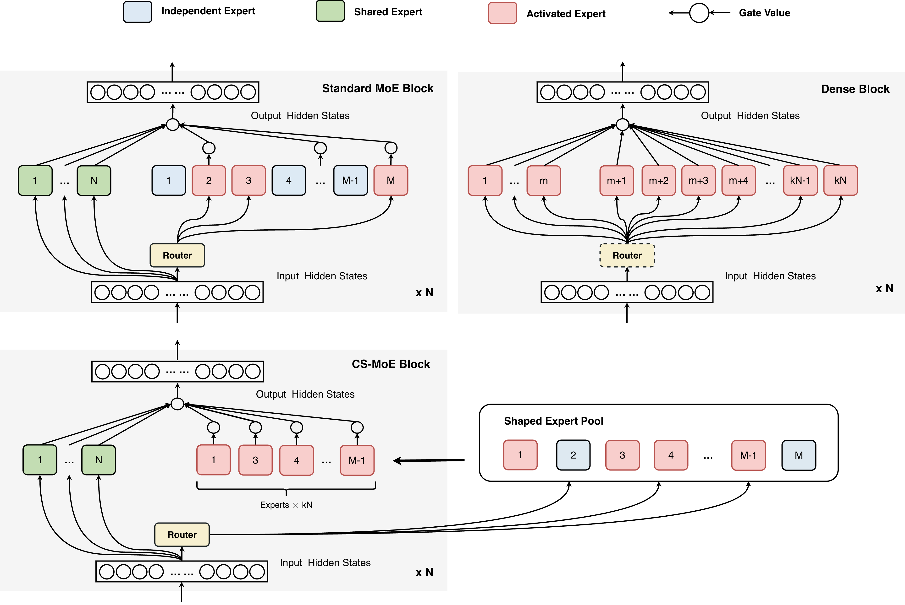
<p><em>Figure 1: Comparison of Transformer architectures — Dense (left), Standard MoE (center), and CS-MoE (right).</em></p>
</div>

---

## Motivation: Why Cross-Layer Sharing?

A pilot study using Centered Kernel Alignment (CKA) reveals that experts across different Transformer layers learn **functionally similar transformations**.

<div align="center">
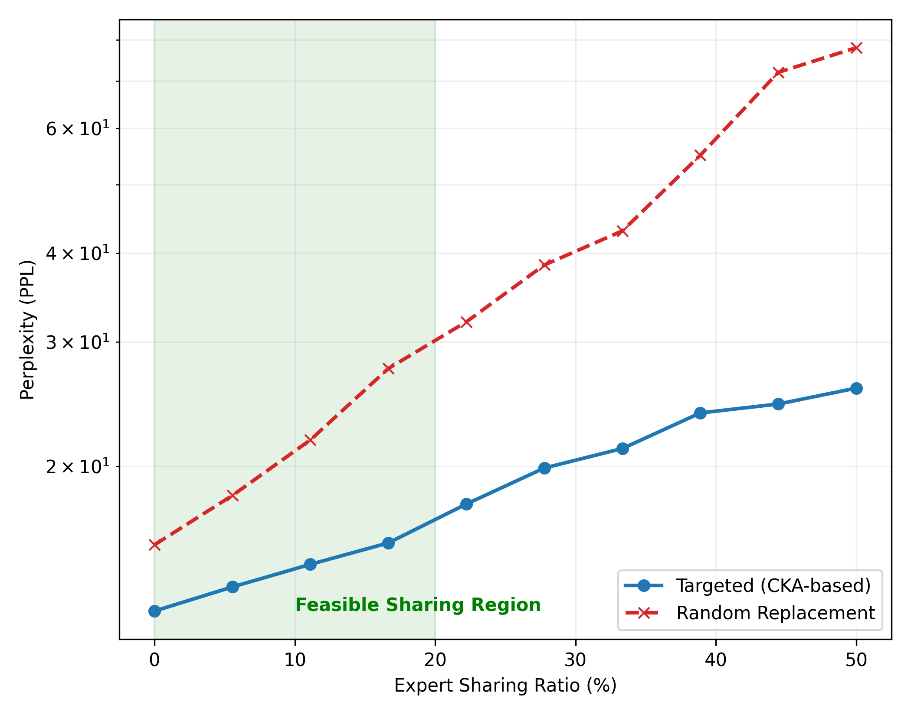
<p><em>Figure 2: Zero-shot expert substitution guided by CKA similarity incurs far less perplexity degradation than random replacement, confirming experts are interchangeable across depths.</em></p>
</div>

This observation motivates CS-MoE's core design: instead of redundantly re-learning the same transformations at every layer, a shared expert pool enables **longitudinal reuse** of common semantic operators.

---

## Architecture

CS-MoE restructures each Transformer layer into a dual-path execution model:

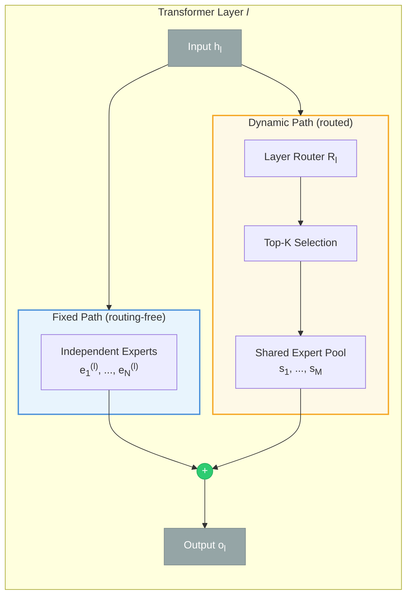

**Expert partition across layers:**

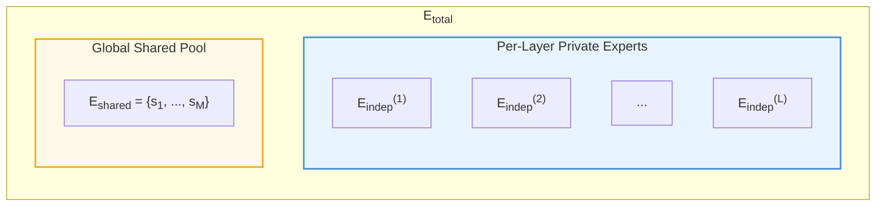

Each layer activates $(k+1)N$ total experts: $N$ independent + $kN$ routed from the shared pool.

### Output Computation

$$\mathbf{o}_l = \underbrace{\sum_{j=1}^{N_{indep}} \text{Expert}_{e,j}^{(l)}(\mathbf{h}_l)}_{\text{Fixed Path}} + \underbrace{\sum_{i \in \text{TopK}} g_{l,i} \cdot \text{Expert}_{s,i}(\mathbf{h}_l)}_{\text{Dynamic Path}}$$

---

## Key Results

### Experiment 1: Efficiency Gains — CS-MoE vs. Dense

CS-MoE consistently outperforms Dense baselines across all scales with aligned FLOPs.

<div align="center">
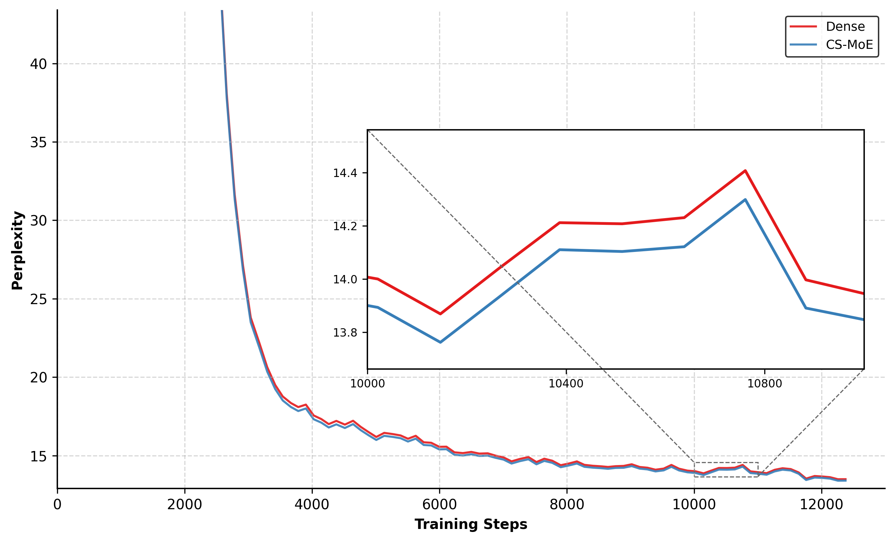
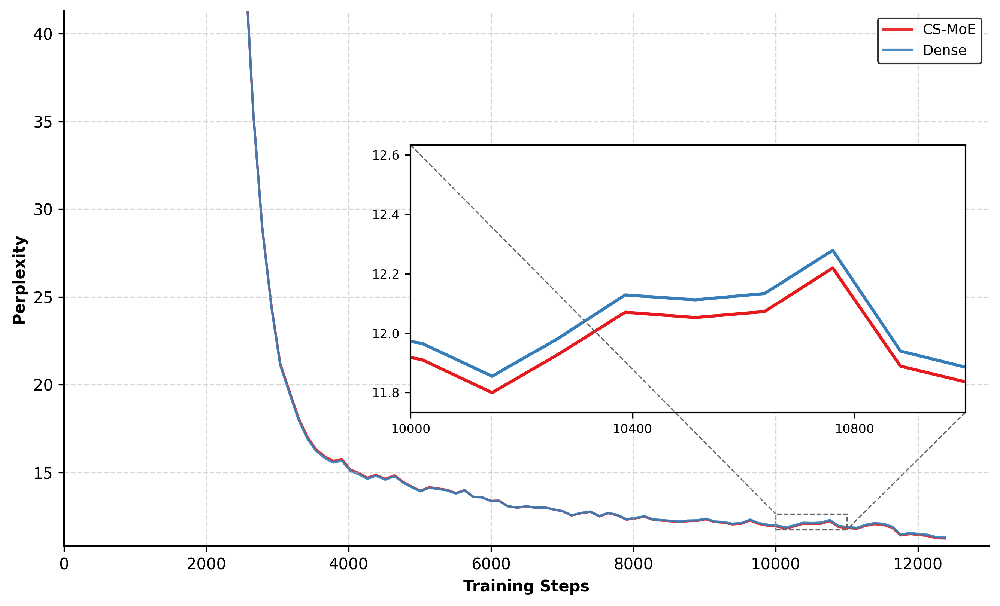
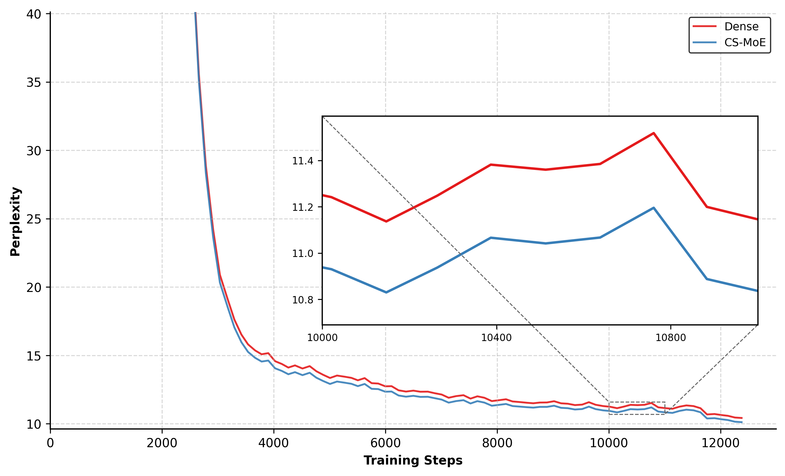
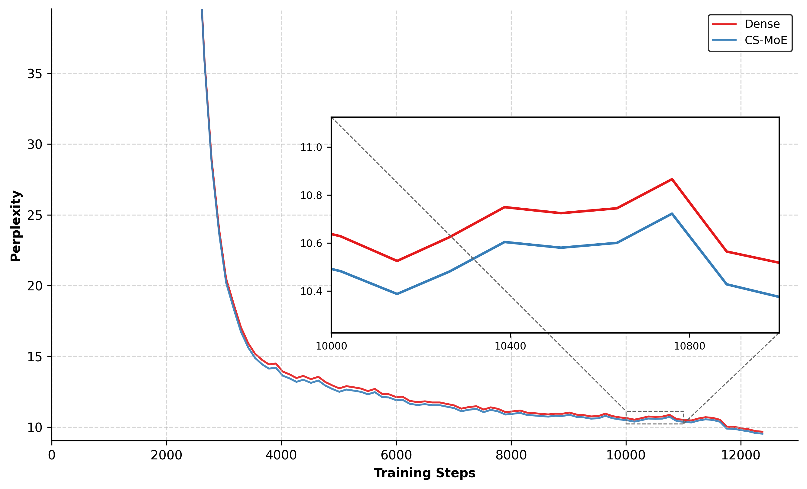
<p><em>Figure 3: Training perplexity comparison across 0.6B, 1.7B, 4B, and 8B scales. CS-MoE (colored) consistently achieves lower PPL than Dense (gray) at each scale.</em></p>
</div>

### Experiment 2: Scalable Compute — Increasing Activation Count

With fixed total parameters, increasing the expert activation count $K$ yields monotonic performance gains, bypassing the traditional "Parameter-Compute bottleneck."

<div align="center">
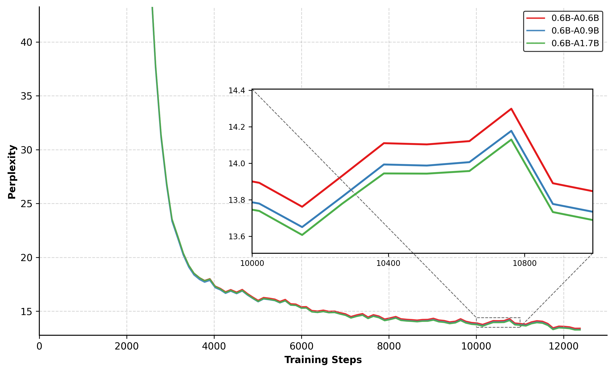
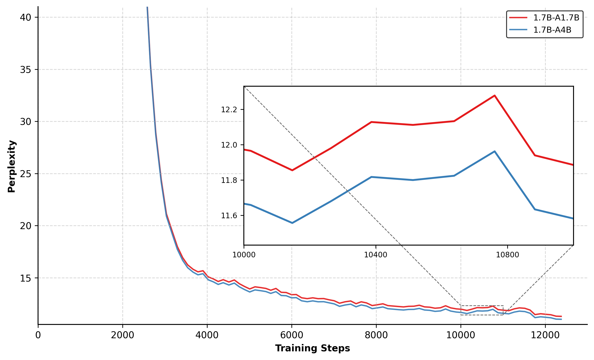
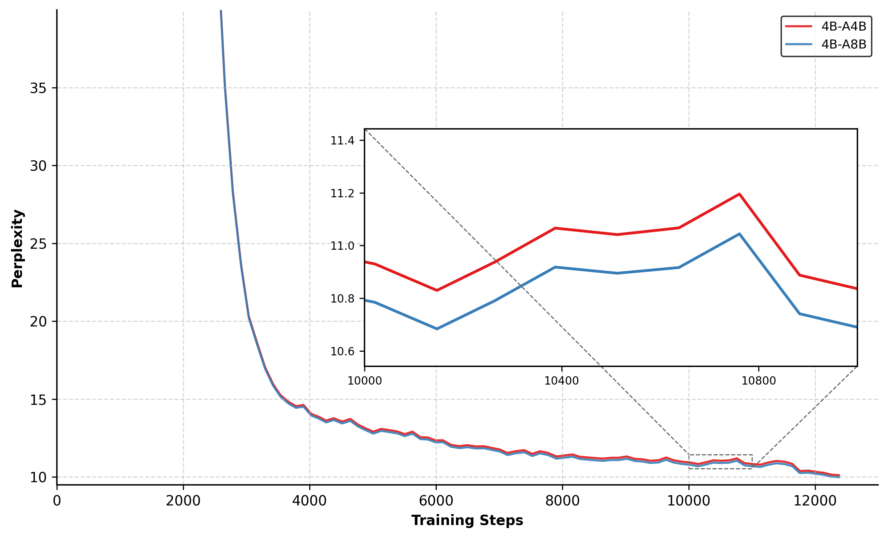
<p><em>Figure 4: CS-MoE with varying activation levels (A0.6B, A0.9B, A1.7B). More activations → continuous improvement.</em></p>
</div>

### Experiment 3: Convergence toward Standard MoE

As the shared pool expands, CS-MoE performance asymptotically approaches standard MoE, defining a flexible Pareto frontier.

<div align="center">
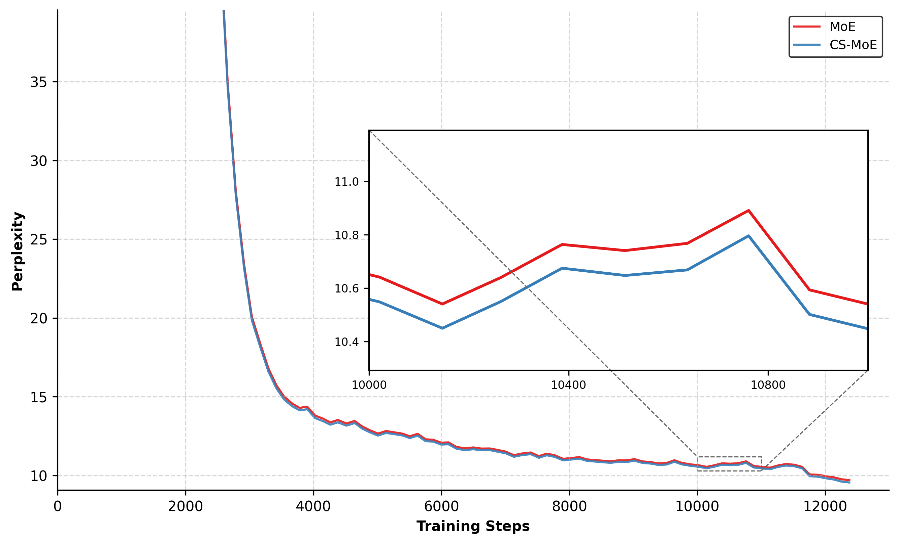
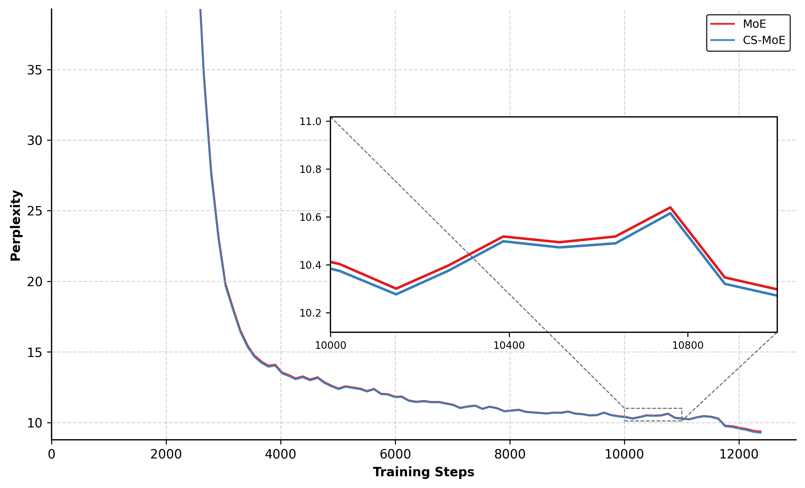
<p><em>Figure 5: CS-MoE vs. Standard MoE under equal activations. CS-MoE converges toward MoE performance as pool size grows.</em></p>
</div>

<div align="center">
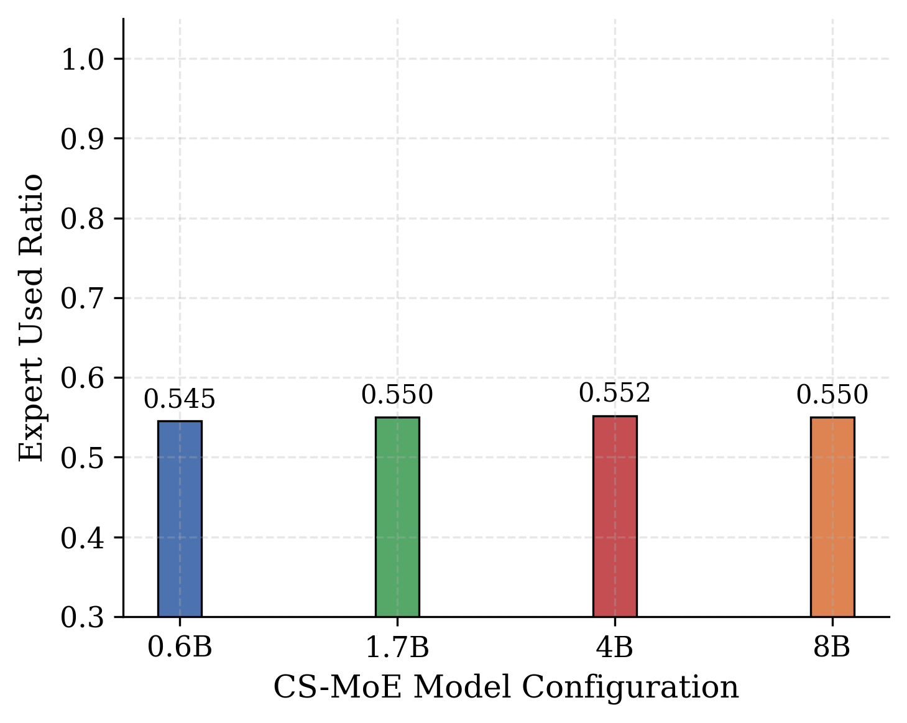
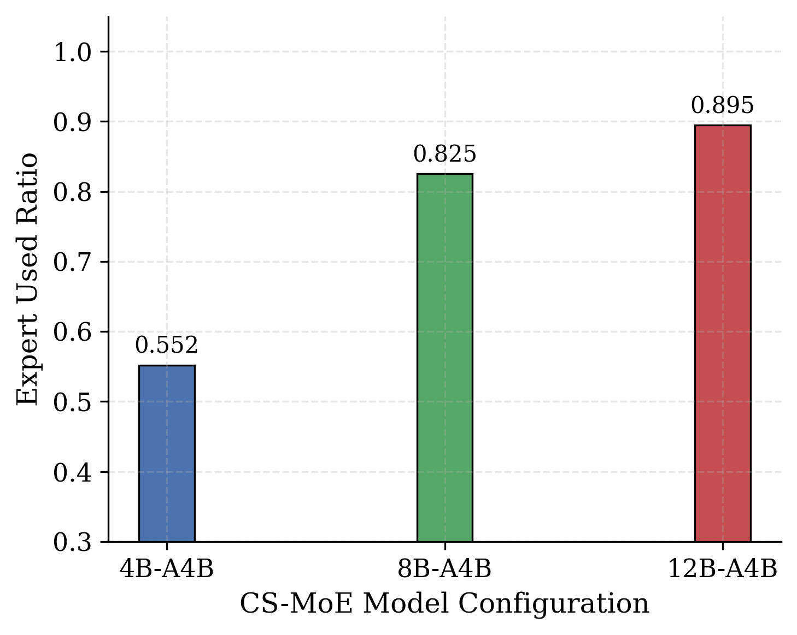
<p><em>Figure 6: Expert Utilization Ratio (EUR) increases with model scale (left) and approaches ~1.0 at 4B activations (right), confirming efficient expert reuse.</em></p>
</div>

### Downstream Benchmarks

CS-MoE achieves consistent gains on downstream tasks across all training checkpoints:

| Model | CVEAL | AQuA | Gap (CVEAL) | Gap (AQuA) |
|-------|:-----:|:----:|:-----------:|:----------:|
| Dense 0.6B | 37.5 | 31.2 | — | — |
| CS-MoE 0.6B-A0.9B | **41.9** | **36.4** | +4.4 | +5.2 |
| Dense 1.7B | 38.6 | 32.6 | — | — |
| CS-MoE 1.7B-A4B | **42.3** | **37.8** | +3.7 | +5.2 |
| Dense 4B | 40.7 | 39.1 | — | — |
| CS-MoE 4B-A8B | **43.2** | **40.5** | +2.5 | +1.4 |

> Gains are most pronounced at smaller scales, where the shared pool provides proportionally larger representational benefit.

---

## Model Configurations

All models use the [Qwen3-MoE](https://github.com/huggingface/transformers/tree/main/src/transformers/models/qwen3_moe) backbone with GQA, SwiGLU, and RoPE.

| Model | Total Params | Activated Params | Layers | $d_{ffn}$ | $d_{exp}$ | Shared Pool ($M$) | Top-$K$ |
|-------|-------------|-----------------|--------|-----------|-----------|:-----------------:|:-------:|
| Dense | 0.6B–8B | Same | 16–36 | 3,072–12,288 | - | - | - |
| **CS-MoE 0.6B** | 0.6B | 0.6B / 0.9B / 1.7B | 28 | 3,072 | 768 | 84 | 4 / 10 / 21 |
| **CS-MoE 1.7B** | 1.7B | 1.7B / 4B | 28 | 6,144 | 1,536 | 84 | 4 / 13 |
| **CS-MoE 4B** | 4B | 4B / 8B | 36 | 9,728 | 2,432 | 108 | 4 / 10 |
| **CS-MoE 8B** | 8B | 4B / 8B | 36 | 9,728–12,288 | 2,432–3,072 | 324 | 4 |
| **CS-MoE 12B** | 12B | 4B | 36 | 9,728 | 2,432 | 540 | 4 |

*Top-$K$ includes independent experts per layer ($N_{indep}=1$).*

---

## Training Details

| Hyperparameter | Setting |
|---------------|---------|
| Optimizer | AdamW ($\beta_1\!=\!0.9,\; \beta_2\!=\!0.95,\; \epsilon\!=\!1\text{e-}8$) |
| Learning Rate | 3e-4 |
| Weight Decay | 0.01 |
| Batch Size | 512 (effective tokens ~1M) |
| Warmup Steps | 1,000 |
| Total Steps | 12,500 |
| LR Schedule | Cosine Annealing to $0.1 \times \text{LR}_{\max}$ |
| Context Length | 2,048 |
| Load Balancing $\alpha$ | 0.01 |

**Training Data**: WuDao + DCLM corpora
**Hardware**: 8× NVIDIA H200 GPUs
**Framework**: Customized [Megatron-LM](https://github.com/NVIDIA/Megatron-LM)

---

## Comparison with Related Approaches

| Approach | Sharing Type | Dynamic? | Inter-layer? |
|----------|-------------|:--------:|:------------:|
| ALBERT | Uniform all-layer | ✗ | ✓ (rigid) |
| Universal Transformers | Recurrent single-layer | Partial | ✓ (sequential) |
| DeepSeekMoE | Intra-layer shared experts | ✓ | ✗ |
| **CS-MoE** | **Inter-layer shared pool** | **✓** | **✓ (flexible)** |

CS-MoE uniquely combines **per-token dynamic routing** with **genuine inter-layer sharing**, achieving the best of both worlds: depth-specific specialization via independent experts and cross-layer functional reuse via the shared pool.

---

## Citation

```bibtex
@article{jiao2026csmoe,
  title={Improving Parameter Utilization by Sharing Neural Experts Across Transformer Layers},
  author={Jiao, Dian and Duan, Jiaxin and Zhao, Shuai and Wang, Jian and Leng, Jiabing and Zhang, Yiran and Huang, Feng},
  journal={arXiv preprint},
  year={2026}
}
```

---

## License

This project is released under the MIT License.

## Acknowledgments

We thank the [Qwen Team](https://github.com/QwenLM) for the Qwen3-MoE architecture and the [Megatron-LM](https://github.com/NVIDIA/Megatron-LM) team for the distributed training framework.
